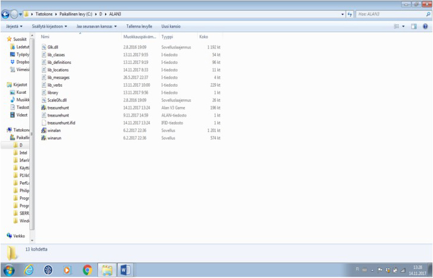

////
********************************************************************************
*                                                                              *
*                     ALAN Standard Library User's Manual                      *
*                                                                              *
*                                  Chapter 2                                   *
*                                                                              *
********************************************************************************
////

[[ch2]]
== What is different in v2.x?

* the author doesn't necessarily need to access the library files any longer when writing a game. It is possible to write a game just importing the library and define everything in your own game source file(s). It is still possible to edit the library files directly if this is preferred. There are also some cases when the library needs to be accessed, for example when changing standard runtime messages.

* there are five library files in v2.x (instead of four in v1.x): `lib_classes.i`, `lib_definitions.i`, `lib_locations.i`, `lib_messages.i` and `lib_verbs.i`.

* the `hero` instance is left out of the library.
It can be now defined from scratch by the game author.
(There are still checks for the hero within various verbs, and these work whether the author defines the hero or not.
There are also numerous default verb responses and other messages that take the hero into account, just like in the previous version of the library, but these can be easily overridden.)

* an obligatory meta instance, `my_game`, needs to be coded by the author to each new game.
Its shortest possible formulation is
+
[source,alan]
--------------------------------------------------------------------------------
THE my_game ISA DEFINITION_BLOCK
END THE.
--------------------------------------------------------------------------------
+
Without it, the game won’t compile correctly.
Inside this instance, it is possible for example to override default messages provided by the library, like this:
+
[source,alan]
--------------------------------------------------------------------------------
THE my_game ISA DEFINITION_BLOCK
  VERB examine
DOES ONLY "Nothing special."  -- your own default message for
                              -- examining objects, instead of
  END VERB.                   -- the default provided by the
                              -- library
END THE.
--------------------------------------------------------------------------------
+
(The default library message for examining various things is "`You notice nothing unusual about [the object].`"
Above, the author has replaced this default message with a shorter phrasing.)+
In the my_game instance, you can also define global attributes, verb check messages, illegal parameter messages and many other things.
See further p. 78.

* check messages and illegal parameter messages can be edited much more smoothly.
For example, you don't have edit the same check for every verb separately (or cut and paste); you can now change the wording in one place and it will affect all the places where that same check is found, throughout the library.

* the `LISTABLE_CONTAINER` class of version 1.0 has been renamed `LISTED_CONTAINER` which sounds slightly better.

* there are some new attributes:

** `allowed` is needed for container objects to indicate which objects they can take:
+
[source,alan]
--------------------------------------------------------------------------------
THE drawer ISA LISTED_CONTAINER IN nightstand
  HAS allowed {diary, keys}.
  ...
END THE drawer.
--------------------------------------------------------------------------------
+
This will effectively prohibit unwanted successful outcomes for player commands such as >put coffee cup in drawer or >put suitcase in drawer.
Besides `put_in`, this attribute also applies to the verbs `empty_in`, `pour_in` and `throw_in`.

** `distant`/`NOT distant`, in addition to the existing `reachable`/`NOT reachable`.
This has proved to be a handy distinction to have at hand.
It is possible for the hero for example to talk with an NPC (non-player character) that is NOT reachable (for example if the hero is lying down on a bed), but not with one that is distant.
Similarly, you can throw something at, to or into a NOT reachable instance (for example a basketball into a basket), but not at, to or into a distant one.
There are also some other individual cases where you can manipulate NOT reachable objects as opposed to distant ones.
The default responses for NOT reachable and distant objects are a bit different: a NOT reachable object is described to be "`out of your reach`" but a distant one is "`too far away`".
For example the library-defined ceiling object for indoor rooms is NOT reachable ("`The ceiling is out of your reach`") while the library-defined sky object is distant ("`The sky is too far away`").

** ACTORS are defined to be either `compliant` or `NOT compliant`.
By default, they are NOT compliant.
This attribute is needed when we try to get something from an NPC (a non-player character).
For example, the verb `take_from` doesn't work with ACTORS by default; the only way to make an ACTOR give you something in their possession by default is to ask for it.
Also implicit taking doesn't work with ACTORS, i.e. if an NPC is carrying an apple and you type >eat apple, the outcome will be "`That seems to belong to the [NPC].`"; the apple won't be automatically taken by the hero like it would if it was not carried by anyone.

** every DOOR now has an `otherside` attribute which can be used if the game author wants to ensure that a DOOR will be correctly opened, closed, locked and unlocked from both sides.
When the open/closed status of a DOOR instance changes, the status of its otherside counterpart (in the next room) is changed accordingly by the library.
(If the author declares no otherside attribute for a DOOR, then this doesn't happen automatically.)
+
[source,alan]
--------------------------------------------------------------------------------
THE kitchen_door ISA DOOR AT kitchen
  HAS otherside livingroom_door.
  IS lockable. IS locked.
  HAS matching_key small_key.
END THE.

THE livingroom_door ISA DOOR AT livingroom
END THE.

THE small_key ISA OBJECT IN drawer
END THE.
--------------------------------------------------------------------------------
+
Above, the `livingroom_door` will also be lockable, locked, have `otherside kitchen_door` and can be opened by the `small_key`, even if none of these attributes were explicitly declared in the livingroom_door code.

** every lockable DOOR has a `matching_key` attribute (see the above example) which should be declared at the DOOR instance if it's meant to be locked/unlocked.
If the hero carries the matching key of a locked DOOR, unlocking will be possible through just >unlock door or even >open door and not necessarily using the longer formulation >unlock door with key.
This attribute also eases up the coding required for locked DOORs.

** the closed and closeable attributes have been changed to open and openable which is more intuitive.

** the `SCENERY` class has been removed.
Instead, `scenery` is declared as an attribute.

** similarly, the `BACKGROUND` class has been removed.
Use the (NOT) `reachable`/`distant` attributes instead where applicable.

* some object classes are made to work in a simpler way from v1.0.
For example, an object in the subclass `LIQUID` won't have to be declared to have a vessel attribute any longer (if the liquid is carried in a vessel of any kind).
+
[source,alan]
--------------------------------------------------------------------------------
THE juice ISA LIQUID IN bottle
END THE juice.

THE bottle ISA LISTED_CONTAINER
END THE bottle.
--------------------------------------------------------------------------------

* similarly, `CLOTHING` objects worn by the hero and any NPCs can now be implemented more smoothly:
+
[source,alan]
--------------------------------------------------------------------------------
THE hero ISA ACTOR
  IS wearing {jeans, shirt}.
END THE hero.

THE jeans ISA CLOTHING
  IS...
END THE.

THE shirt ISA CLOTHING
  IS...
END THE.
--------------------------------------------------------------------------------
+
or
+
[source,alan]
--------------------------------------------------------------------------------
THE jill ISA ACTOR AT garden
  IS wearing {dress}.
END THE jill.

THE dress ISA CLOTHING
END THE dress.
--------------------------------------------------------------------------------

* formatting the game title, author, year and version at the start of the game is made easier.
There is an automatic formulation which can be easily included if desired.

* some default verb responses have been changed from v1.0.
For example, the response for simplified.

* it is possible to make any group of verbs to work similarly at once, handy when you for example need to restrict certain verbs from working in the usual way, for example if the hero is tied into a chair, hiding etc.
+
[source,alan]
--------------------------------------------------------------------------------
EVENT tied_up
  "One of the thugs ties you tightly into a chair and gags you, and
  you cannot move your arms or legs at all."
  SET restricted_level OF my_game TO 2. -- = you cannot talk or move
END EVENT.
--------------------------------------------------------------------------------
+
(For the various levels of restriction, see p.69-)
+
You can also block any individual verb(s) from functioning in the game:
+
[source,alan]
--------------------------------------------------------------------------------
THE my_game ISA DEFINITION_BLOCK
  CAN NOT dance.
  CAN NOT jump.
  CAN NOT sing.
  HAS restricted_response "You're not supposed to have any fun in this game."
END THE my_game.
--------------------------------------------------------------------------------

=== How to import the standard library into an ALAN game

To write an ALAN game, you won't necessarily need the standard library at all.
It is perfectly possible to define everything in your game by yourself.
At its bare-bones minimum, an ALAN game needs one location and a "START AT" instruction:

[source,alan]
--------------------------------------------------------------------------------
THE meadow ISA LOCATION
END THE meadow.

START AT meadow.
--------------------------------------------------------------------------------

This code compiles successfully and doesn't use the library at all.
When you try to play this game, you will find yourself at a location called 'Meadow' but you can't do anything, not even prompt will be understood.
You should go on implementing everything by yourself.

When you import the library, there are a couple of extra things you need to add to the code:

[source,alan]
--------------------------------------------------------------------------------
IMPORT 'library.i'.

THE my_game ISA DEFINITION_BLOCK
END THE my_game.

THE meadow ISA LOCATION
END THE meadow.

START AT meadow.
--------------------------------------------------------------------------------

Now, when you run the game, you will find yourself at the meadow location, but you can look, wait, examine yourself, take inventory, try to go in a direction, think, listen, smell, type 'help' for assistance, and many other things.

The IMPORT statement imports the library files into the game code.
The five obligatory library files mentioned on p.1, together with the file 'library.i' that imports them, should be in the same folder as your source code file.

If you don't have 'library.i' in the same folder as the obligatory library files, you should import the obligatory library files in the following way (which is somewhat lengthier):

[source,alan]
--------------------------------------------------------------------------------
IMPORT 'lib_classes.i'.
IMPORT 'lib_definitions.i'.
IMPORT 'lib_locations.i'.
IMPORT 'lib_messages.i'.
IMPORT 'lib_verbs.i'.
--------------------------------------------------------------------------------

My_game is an obligatory instance that you have to include in your game source file when using the library.
It will be described in more detail on p.78.

Here is a screenshot of what a typical ALAN project folder might look like:

Notes to the above image:

Notice the five obligatory library files (all starting with 'lib_...'), together with the file 'library.i' that imports them to a game project.
In addition, there are two DLL files that are automatically installed to where you install the ALAN interpreter.
If you copy the interpreter program to another folder, you should also copy these two DLL files.
The compiler and the interpreter in this example are the Windows executables winalan.exe and winarun.exe, respectively.
In this example, an author has started writing a new game called Treasure Hunt, and 'treasurehunt.alan' is the source file (a normal text file containing the ALAN code) while 'treasurehunt.a3c' is the compiled game.
An IFID file is created automatically when you compile an ALAN game.
IFID stands for Interactive Fiction IDentifier.
An IFID is a serial number that's assigned to each work of Interactive Fiction.
Each work has its own unique IFID, giving players, authors, and archivists a universal, unambiguous way to refer to a given game.
It's the same idea as the ISBN system for books.
The IFID system is defined by the Treaty of Babel which was created in 2006.

// EOF //

